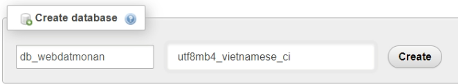

Một số template được sử dụng và tham khảo: 
 
https://github.com/vijaythapa333/web-design-course-restaurant?fbclid=IwAR34-cKAIgt9NE9nFkhz4A-8fXDvEJrGUxtxQ22emefquRHZ2g8Ry-rtMG4: 
    - Trang chủ (menu.php)
 
https://bootsnipp.com/snippets/vl4R7
    - Đăng nhập (login.php)

https://codepen.io/omariohasan/pen/zNZXKo
    - Sign Up (register.php)
 
<h1>Các bước để tải về và sử dụng</h1>

B1: tải chương trình về máy
https://github.com/anhquanphamquoc/Web-dat-mon-an-trong-truong-hoc.git

B2: tải và cài đặt xampp về máy

B3: vào trình duyệt mở
http://localhost/phpmyadmin/

B4: chọn tạo database mới. Đặt tên và thiết lập như hình

B5: vào databse đó, chọn "nhập" hoặc "import" nếu là tiếng anh

B6: chọn file trong sql rồi tiến hành import vào là được

B7: vào localhost -> chọn file web-dat-mon-an-trong-truong-hoc

<h4>Một số tài khoản có sẵn để đăng nhập</h4>
Admin
+ username: admin
+ password: admin

Student

